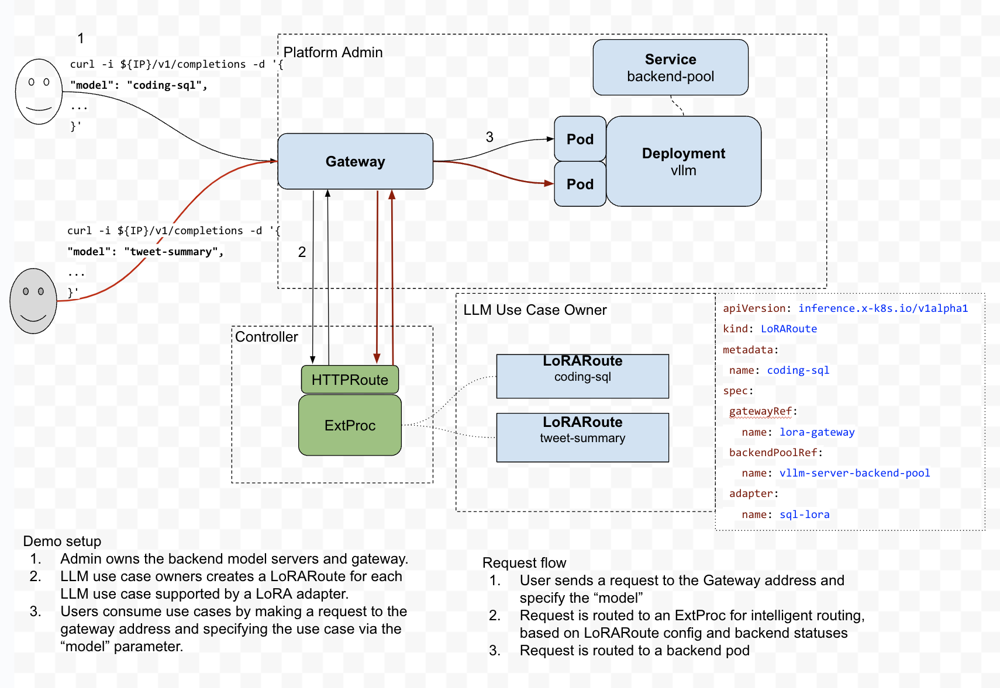

# lora
This repo contains kubernetes Custom Resource Definitions (CRDs) and controller logic for efficiently
// multiplexing LoRA adapters over a pool of shared model servers.

## Description


The core controller logic lives in `internal/controller/loraroute_controller.go` and `internal/controller/servingbackendpool_controller.go`. The `LoRARouteReconciler` watches for changes in LoRARoute resources and
configures the HTTPRoute that connect the Gateway to the ExtProc service. The `ServingBackendPoolReconciler` watches for changes
in k8s Services with label `inference.x-k8s.io/lora-backend: true`, and configures the ExtProc service.

Note the above implementation will likely to change, the expected changes are:
- Having the LoRARoute CRD directly specify backend pods using label selector, instead of through a 
  k8s service. Therefore the `ServingBackendPoolReconciler` will be deprecated.
- ExtProc will be created on demand when the first LoRARoute resource is created. There will be one
  ExtProc per Gateway.

## Getting Started

### Prerequisites
- go version v1.22.0+
- docker version 17.03+.
- kubectl version v1.11.3+.
- Access to a Kubernetes v1.11.3+ cluster.

### To Deploy on the cluster

#### Install the CRDs

```sh
make install
```

#### Run the controller locally
```sh
make run
```

#### Deploy the demo application
You can apply the samples (examples) from the config/sample:

```sh
kubectl apply -k config/samples/
```

Then use the sample requests in config/samples/demo.md to make requests to your LoRAs.

#### Build and run the controller as a container
Build and push your image to the location specified by `IMG`:

```sh
make docker-build docker-push IMG=<some-registry>/lora:tag
```

**NOTE:** This image ought to be published in the personal registry you specified.
And it is required to have access to pull the image from the working environment.
Make sure you have the proper permission to the registry if the above commands don’t work.

Deploy the Manager to the cluster with the image specified by `IMG`:

```sh
make deploy IMG=<some-registry>/lora:tag
```

> **NOTE**: If you encounter RBAC errors, you may need to grant yourself cluster-admin
privileges or be logged in as admin.


### To Uninstall
**Delete the instances (CRs) from the cluster:**

```sh
kubectl delete -k config/samples/
```

**Delete the APIs(CRDs) from the cluster:**

```sh
make uninstall
```

**UnDeploy the controller from the cluster:**

```sh
make undeploy
```

## Project Distribution

Following are the steps to build the installer and distribute this project to users.

1. Build the installer for the image built and published in the registry:

```sh
make build-installer IMG=<some-registry>/lora:tag
```

NOTE: The makefile target mentioned above generates an 'install.yaml'
file in the dist directory. This file contains all the resources built
with Kustomize, which are necessary to install this project without
its dependencies.

2. Using the installer

Users can just run kubectl apply -f <URL for YAML BUNDLE> to install the project, i.e.:

```sh
kubectl apply -f https://raw.githubusercontent.com/<org>/lora/<tag or branch>/dist/install.yaml
```

## Contributing

**NOTE:** Run `make help` for more information on all potential `make` targets

More information can be found via the [Kubebuilder Documentation](https://book.kubebuilder.io/introduction.html)

### vllm fork
The routing algorithm relies on certain metrics that are not available in upstream vllm, therefore
we forked vllm and added the metrics. The fork can be found at https://github.com/kaushikmitr/vllm.
The forked vllm has been built to a container image `us-central1-docker.pkg.dev/conliu-anthos-dev/lora/vllm:v0.2`.

Edit the vllm container image in config/samples/backend.yaml if you need to update the vllm container.

### ExtProc
The core routing algorithm is implemented in an Envoy ExtProc grpc server. The code lives in 
https://github.com/kaushikmitr/lora-inference-gateway/blob/main/envoy-extension/main.go. If you need
to update the ExtProc binary, update the `extProcContainer` parameter in `internal/controller/constants.go`.

## License

Copyright 2024.

Licensed under the Apache License, Version 2.0 (the "License");
you may not use this file except in compliance with the License.
You may obtain a copy of the License at

    http://www.apache.org/licenses/LICENSE-2.0

Unless required by applicable law or agreed to in writing, software
distributed under the License is distributed on an "AS IS" BASIS,
WITHOUT WARRANTIES OR CONDITIONS OF ANY KIND, either express or implied.
See the License for the specific language governing permissions and
limitations under the License.

