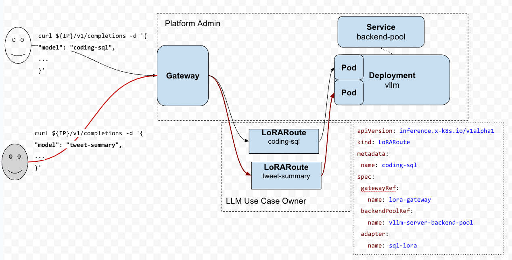

## Deploy the demo application
```sh
kubectl apply -k config/samples
```


## Make a request to the LoRARoutes
Get gateway address:

```
IP=$(kubectl get gateway/genai-inference-gateway -o jsonpath='{.status.addresses[0].value}')
PORT=80

# Make a request to coding-sql
curl -i ${IP}:${PORT}/v1/completions  -H 'Content-Type: application/json' -d '{
"model": "coding-sql",
"prompt": "Write a SQL query to answer the question based on the table schema.\n\n context: CREATE TABLE table_name_74 (icao VARCHAR, airport VARCHAR)\n\n question: Name the ICAO for seatac international airport",
"max_tokens": 256,
"temperature": 0,
"stop": ["[/assistant]"]
}'

# Make a request to tweet-summary
curl -i ${IP}:${PORT}/v1/completions -H 'Content-Type: application/json' -d '{
"model": "tweet-summary",
"prompt": "Write as if you were a critic: San Francisco",
"max_tokens": 100,
"temperature": 0
}'

# Make a request to foo(doesn't exist)
curl -i ${IP}:${PORT}/v1/completions -H 'Content-Type: application/json' -d '{
"model": "foo",
"prompt": "Write as if you were a critic: San Francisco",
"max_tokens": 100,
"temperature": 0
}'
```